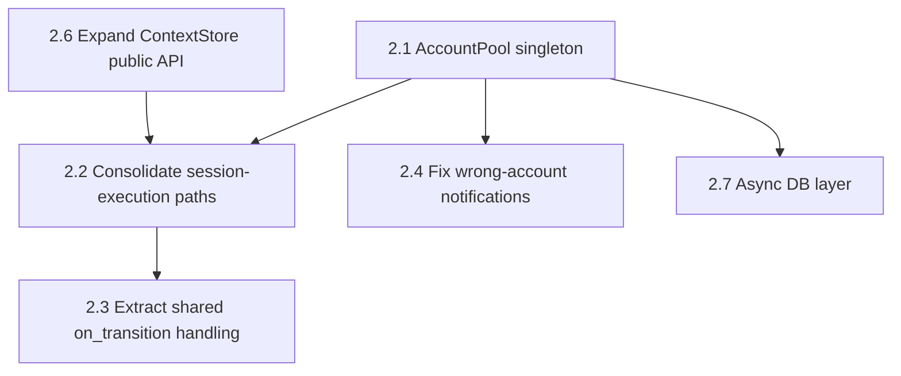

# AGENTS.md — Hirschberg / JAT Repair Backlog

This file is a machine-actionable work order derived from a full source-level audit of this repository (45+ files read directly). It exists so a coding agent can execute repairs without a human re-deriving the diagnosis first. It's a companion to this repo's own root `AGENTS.md` (see §1 for exactly how the two relate), not a replacement for it. Work phase by phase, top to bottom — later phases assume earlier ones are done. Finding numbers (`#N`) are stable references back to the source audit; keep them in commit messages so a human reviewer can trace any change back to its reasoning.

If you are an autonomous agent executing this file and a live instruction from your operator conflicts with something here, the live instruction wins — this file is a backlog, not an override.

---

## 1. How this relates to this repo's root `AGENTS.md`

This repository already has a root `AGENTS.md`, loaded automatically before every task here, governing an active refactor tracked as a long numbered sequence of steps in `.jules/refactor/v1/` (`1.md`, `2.md`, …), with progress recorded in `docs/changelog.json` and one journal file per step under `.jules/journals/`. Its mindset, standing engineering rules, verification standard, and self-review discipline apply to all work in this repository, including this backlog — §3 through §6 below adapt them for this backlog specifically rather than repeat them unchanged.

What this document deliberately does **not** inherit is that document's step-sequencing machinery. This backlog is a separate track of work — bugs and architecture findings from a full audit — not another entry in the `.jules/refactor/v1/` sequence. Concretely:

- Don't run the root document's "find your step" orientation logic against this backlog. Your task here is whichever Phase/task the person directing you names, not the next unclaimed `N.md`.
- Don't write journal entries into `.jules/journals/` or append entries to `docs/changelog.json` for work done from this file. Those are the refactor's own records, keyed to its own step numbers; a repair-backlog entry using that scheme would be indistinguishable from — and could collide with — a real refactor step. If this backlog's progress needs a durable record beyond commit history, that's a decision for whoever's directing the work, not something to invent by extending the refactor's own files.
- If a `.jules/refactor/v1/` step is genuinely in flight on this repository at the same time as this backlog, that's a coordination question for whoever's directing both — don't resolve it yourself by inferring precedence between the two.

---

## 2. Repo orientation

- **Backend**: Python ≥3.11, FastAPI + `asyncio`, SQLite (via a hand-rolled `LocalDB`) with a parallel, currently-unwired Postgres/Supabase schema. Entry points are declared under `[project.scripts]` in `pyproject.toml` (`jat`, `jat-cli`) and `src/server_launcher.py` — use those rather than guessing a `uvicorn` invocation.
- **Frontend**: `dashboard/` — React 19 + Vite 6 + TypeScript 5.8, package manager pinned to `pnpm@10.33.0`. `pnpm install`, `pnpm dev`, `pnpm build` (build runs `tsc --noEmit` first).
- **Backend module map** (only the parts this backlog touches):
  - `src/api/` — FastAPI routers. One file per resource *except* `server.py`, which is oversized (see Phase 3).
  - `src/core/` — orchestration logic: `coordinator.py`, `workflow_engine.py`, `decomposer.py`, `account_pool.py`, `session_poller.py`, `session_runner.py`, `auto_mode.py`, `qa_reviewer.py`, `auto_merge.py`, `merge_review.py`, `orchestrator_relay.py`, `context_store.py`, `ai_interface.py`, `config_loader.py`.
  - `src/clients/` — external API clients: `jules.py`, `github.py`, `ai_providers.py`, `database.py`, `local_db.py`. These should be the *only* code that talks to Jules, GitHub, AI providers, or SQL directly.
  - `src/models/` — Pydantic domain models. Framework-free; keep it that way.
  - `.jules/` — the root `AGENTS.md`'s own territory: refactor task prompts (`refactor/v1/`) and per-step journals (`journals/`). Read-only context for this backlog, per §1 — not a place this backlog's own work gets recorded.
- **Existing lint/type conventions** (already configured — follow them, don't relax them): `ruff` with `select = ["E", "F", "I", "N", "W", "UP", "B", "SIM"]`; `mypy` with `strict = true`. Run both before considering any task done.
- **Logging**: `structlog` (`log = structlog.get_logger()`) is the established pattern. Never use bare `print()` for anything other than genuine CLI user output — `print()` bypasses the secret-masking processor configured in `config.py`.

---

## 3. Who you are, and when to stop and ask

Operate the way the root `AGENTS.md` expects on any task in this repository: as an engineer who takes ownership of code quality, verifies before claiming something works, and says "this doesn't add up" instead of quietly working around it — while treating restraint (recognizing what's out of scope and staying out of it) as part of that judgment, not a limit on it.

Stop and ask, rather than guess, when: a task's premise doesn't match what you actually find in the code, a task is genuinely open to more than one reasonable reading, something environmental stops you cold (a dependency won't install, a service isn't reachable), or a task conflicts with a rule in this document. A **judgment call** — something to make yourself, not stop for — is choosing *how* to do something a task is already unambiguous about: which of several equivalent structures to use, what to name something, how to organize code within constraints the task already sets. If you're not sure which of the two you're in, you're in the second one — stop. "Probably fine either way" is not a reason to decide instead of asking.

When you stop: state plainly what you found, why it conflicts with the task or this document, and what the open question is, rather than smoothing it over or silently picking an interpretation. Once you have an answer, treat it as authoritative and proceed — even where it overrides a rule here — with one exception: if what's being asked is actually wrong (would break something) or impossible (can't be done as specified), say so, lay out the alternative, and proceed once you have a decision on that too.

---

## 4. Standing engineering rules

1. **Verify, don't assume.** Every task below names a file/function and a diagnosis from a point-in-time audit. Re-confirm the diagnosis against the actual current source before changing anything — don't take this document's framing on faith.
2. **Locate by name, not by line number.** This backlog deliberately doesn't cite line numbers — the file may have shifted. Find the referenced function/class by name.
3. **Stay in scope.** Do exactly what the task you're on describes. The one narrow exception: if something you're building on turns out broken or incomplete in a way that blocks your own task, fixing the small, contained part of that is in scope — anything larger, note it rather than absorbing it into your diff.
4. **No stubs, no dead branches.** If you start an approach, finish it. Don't leave partially-wired code, unused imports, commented-out old implementations, or a flag with only one live branch.
5. **Search broadly, act narrowly.** Several findings here exist in more places than any one task names — the duplicated `get_jules_key`, the raw-`httpx` bypasses of `JulesClient`/`GitHubClient`, the private-attribute reach-ins into `AccountPool`/`ContextStore`. Grep the whole repository for the pattern before considering a task done; only change what the task actually asks for.
6. **Document as you go.** Every file you add or meaningfully change gets a current header, and `docs/map.json` stays current — see §7. Not optional, not deferred to a later pass.
7. **Every behavioral fix needs a test**, added or updated in the same commit — see §5.
8. **One task, one commit** (or one small PR). Don't batch unrelated tasks together.
9. **No new broad excepts.** Don't add `except Exception: pass`/`return None` without a `log.warning(...)` (or better) inside it — several bugs in this backlog exist because an exception was swallowed silently.
10. **Don't touch what isn't broken.** The audit explicitly credited several things as well-built: `workflow_engine.py`'s DAG/cycle-detection logic, `session_poller.py`'s backoff implementation, `account_pool.py`'s scoring algorithm, `clients/jules.py`/`clients/github.py` internals, `models/jules.py`. Touch only what a task specifies.
11. **When a fix needs a judgment call this document doesn't resolve** (see §3), take the conservative, reversible option and leave a `# TODO(AGENTS.md #N):` comment explaining the open question, rather than guessing silently.
12. **§9 (Explicitly out of scope) is off-limits for this pass**, even where it looks like a natural extension of a task in front of you. Flag it in a task note instead.

---

## 5. Verification standard

A task is done when you've directly confirmed the behavior — run it, exercise the actual code path — not when you've written code that should satisfy it in theory.

- The test suite (Phase 0 builds it; it must exist and pass from Phase 1 onward) passes before you consider any task finished.
- Every task's *Verify* line is a floor, not a ceiling — if you can check it more directly than described, do that instead.
- Pre-existing failures unrelated to your current task: fix them only if the fix is a one-line, obviously-correct change with no behavioral effect beyond the failure itself. Otherwise leave them and say so explicitly in your commit message or PR description — don't silently skip them, and don't go on an unscoped fixing spree either. Expect to hit this often in Phase 0/1, given this backlog exists specifically because 33 pre-existing issues were found — that's expected, not a sign something's wrong.
- Check each task's acceptance criteria literally, one at a time, rather than judging the result "in the spirit of" what was asked.

---

## 6. Self-review before calling a task done

Before you finish a task — after it works and tests pass, but before you commit — review your own diff once as if it were a colleague's PR: is this the simplest approach that fully satisfies the task, does it match this codebase's existing conventions, are there edge cases unaccounted for, is anything under- or over-engineered relative to what the task needs? Act only on what you're confident is a genuine improvement, then re-verify tests and acceptance criteria still hold. Repeat once more if that pass changed something; stop once a pass finds nothing worth changing, or after two passes, whichever comes first — this is meant to catch real problems, not generate churn. If a pass surfaces something outside the current task's boundaries, note it (in your commit message, or as a candidate for Phase 4) rather than acting on it.

---

## 7. Documentation & the `docs/map.json` living document

`.jules/refactor/v1/17.md` retrofitted headers onto the existing codebase and built the `docs/map.json` generator as a one-time pass. It does not stay true on its own. The rules below are what keep it true going forward — including for every file this backlog itself touches.

**Every file you add or meaningfully modify gets a header**, in whatever comment syntax that file type supports, with the same three parts every time:
1. One-line summary of what the file is.
2. What it actually does — main responsibilities, 2–4 sentences or a short list.
3. How it fits in — what it depends on, what depends on it, or what it's tightly coupled to, when that isn't obvious from its location alone.

Match this structure exactly, even when it feels like more ceremony than a small file needs — the value is every file being scannable the same way, not any one header being maximally detailed. `.py` files: a module-level docstring before imports. `.sql`/`.sh`: native comment syntax. `.json` files: a top-level `"_description"` key holding the same three-part summary as one string — use that exact key name, and confirm nothing validates these files against a strict schema that would reject an unrecognized key before adding it (allowlist it there, or use that validator's own metadata mechanism, if so). Already-prose `.md` files skip this — they describe themselves. This applies to files a task actually touches, not a mandate to sweep the rest of the codebase.

**Describe what a file actually does, not what its name or its neighbors suggest it should do.** Several existing headers in this codebase currently describe something other than the file's real content: `exceptions.py`'s docstring names a class (`JATException`) that isn't the one actually defined (`JatError`); `ai_interface.py` is described as an LLM-completion interface but contains a key vault and provider CRUD, no completion calls; `state_recovery.py`'s docstring describes SQLite-scanning crash recovery that's actually implemented in `server.py` (Phase 4's P3.13 covers realigning these deliberately, once Phase 2–3's module boundaries settle — don't jump ahead and do it piecemeal now). Don't add to that list — write a header from the code in front of you, not from a plausible-sounding guess at what a file with that name would typically do.

**Keep `docs/map.json` current.** If a file you add, remove, or rename falls inside the map's scope (everything hand-authored: `.py`, `.json` config/data files, `.sql`, `.sh`/`.bat`, `.yaml`/`.yml`, frontend source — excluding dependency directories, lock files, build output, `.git`, and other tool-generated files), re-run the generator script (check `scripts/` for it — `.jules/refactor/v1/17.md`'s Part B specifies one exists or should) rather than hand-editing the map. A task that leaves `docs/map.json` stale relative to files it touched isn't done.

**CI enforcement**: `.jules/refactor/v1/17.md`'s Part B also calls for a CI check that fails when `docs/map.json` is stale. Confirm whether `.github/workflows/` already has one before assuming it doesn't. If it's missing, add it as part of task 2.11 (this backlog's own CI-setup task) rather than as separate work.

---

## 8. Task format

Each task lists **File(s)**, **Problem** (one line — full reasoning is in the source audit if needed), **Fix**, and **Verify**. *Verify* is the acceptance criterion for the task's functional behavior — it is not the only bar: per §4 and §7, a task also isn't done if it leaves a touched file without a current header, or leaves `docs/map.json` stale relative to files it added, removed, or renamed.

---

## Phase 0 — Test harness bootstrap

Do this before Phase 1. `pyproject.toml` already sets `testpaths = ["tests"]`; the directory simply doesn't exist yet.

**Task 0.1 — Create the test harness.**
Create `tests/` with a `conftest.py` that provides an isolated temporary SQLite DB per test (never point tests at `./data/jat.db`). Add `pytest-asyncio` (or `anyio`) as a dev dependency if not already present — this codebase is `async`-heavy and most of what you're testing is coroutines.
*Verify*: `pytest` runs (even with zero real tests yet) and picks up the directory.

**Task 0.2 — Add an import-everything smoke test.**
One test that walks every module under `src/` and imports it, asserting no exception. **Important calibration**: this catches finding **#2** (`core/merge_review.py`'s broken import is module-level) but will *not* catch **#1** or **#3** — both of those are inside function bodies, so Python doesn't complain until the function actually runs. Don't treat this test as sufficient for those two; Phase 1 tasks 1.1 and 1.3 require their own behavioral tests.
*Verify*: this test fails on current `main`/`development` (confirms it's doing real work), then passes once Phase 1 lands.

**Task 0.3 — Scaffold one end-to-end happy-path test.**
A test (can use mocked `JulesClient`/`GitHubClient` responses) that exercises "workflow with 2+ tasks completes → merges → opens final PR" through `execute_plan`. It's fine for this to start as `xfail` if wiring full mocks is heavy — the point is it exists as a target Phase 1/2 work makes pass for real, and it's the test that most directly proves finding **#2** is actually fixed (not just import-clean).

---

## Phase 1 — Critical fixes (P0)

These are either currently-broken code paths or active security gaps. Independent of each other; order within the phase doesn't matter, but all of them block "the app works as designed."

**1.1 — Fix `core/auto_mode.py`'s `ImportError` on execution [finding #1]**
- *File*: `src/core/auto_mode.py`, `run_auto_mode`.
- *Problem*: imports `_execute_sequential, _execute_parallel, _execute_hybrid` from `api.execute` — none of the three exist there. Every `/api/execute/auto` call crashes the moment planning hands off to execution.
- *Fix*: Replace that import and call with the same pattern `execute_plan` (`api/execute.py`) already uses: build `ContextStore(db)` → `AgentCoordinator(pool, store)` → `WorkflowEngine(coordinator, store)`, then `await engine.run(workflow)`. Confirm the plan object `_planning_phase` produces actually matches `models/workflow.py::Workflow`'s shape before wiring it through — reconcile field names if not.
- *Verify*: new test calling `run_auto_mode` (mocked AI provider + Jules client) reaches and completes the execution phase without raising. (This is *not* covered by Task 0.2 — see its calibration note.)

**1.2 — Fix `core/merge_review.py`'s `ImportError` [finding #2]**
- *File*: `src/core/merge_review.py`, module-level import.
- *Problem*: `from core.plan_executor import create_jules_session, poll_session_status` — `plan_executor.py` only defines `parse_plan`. Since this is a module-level import, *importing this module at all* fails, which breaks: the final-merge step of `execute_plan`, the entire `/api/execute/merge-review` endpoint, and `workflow_engine.py`'s integrator-review path.
- *Fix*: Replace the broken import. Use `clients.jules.JulesClient` directly for session creation and `core.session_poller.SessionPoller` for polling — both are already correct, tested-by-usage components elsewhere in the codebase; don't hand-roll a third implementation.
- *Verify*: `python -c "import core.merge_review"` succeeds. Task 0.3's end-to-end test passes.

**1.3 — Fix the `UUID` `NameError` in `_poll_orchestrator` [finding #3]**
- *File*: `src/api/execute.py`, `_poll_orchestrator`.
- *Problem*: calls `UUID(account_id)` — `UUID` is never imported (module-level or local). The `NameError` is swallowed by a surrounding bare `except Exception: return`, so standing orchestrators silently stop updating immediately after creation.
- *Fix*: add `from uuid import UUID` (match the function's existing style of local imports, or promote to module level alongside the existing `import asyncio`).
- *Verify*: new test that calls `_poll_orchestrator` with a mocked pool/client and confirms it doesn't raise/return-early on that line. Confirm `python -c "from api.execute import _poll_orchestrator"` alone does *not* prove this fixed (function bodies aren't checked at import time) — the behavioral test is the real bar.

**1.4 — Stop silently storing secrets in plaintext [finding #4]**
- *File*: `src/core/ai_interface.py` (`KeyVault`), `src/config.py` (`Settings.encryption_key`).
- *Problem*: `KeyVault` degrades to a silent no-op encrypt/decrypt when `encryption_key` is empty (the default). No warning anywhere.
- *Fix* (recommended approach): on first startup with no `ENCRYPTION_KEY` set, auto-generate a real Fernet key and persist it to `.env`, rather than defaulting to empty — this closes the gap without adding operator burden. If you take the alternative (fail loud instead of auto-generating), it must be a hard refusal to start, not a log line that's easy to miss — either way, "silently store plaintext" is no longer an option.
- *Verify*: starting the app fresh (no prior `.env`) results in a real, non-empty `encryption_key` being used for the very first account ever stored — add a test asserting `KeyVault(settings.encryption_key)._fernet is not None` after a clean startup.

**1.5 — Fix the broken encryption-key rotation [finding #5] — do after 1.4**
- *File*: `src/api/settings.py`, `_migrate_encrypted_rows`.
- *Problem*: `conn = db._get_conn() if hasattr(db, "_get_conn") else None` — `db` (the module-level `Database` wrapper) never has `_get_conn` (only the inner `LocalDB` does), so this is always `None` and the function always silently returns `(0, 0)`, even when a valid previous key existed. The caller then overwrites `.env` with the new key regardless, corrupting every existing encrypted credential.
- *Fix*: Rewrite `_migrate_encrypted_rows` to go through `Database`'s existing public async API — `await db.select(table, columns=[id_col, "api_key_encrypted"])`, decrypt with the old key, re-encrypt with the new key, `await db.update(table, {"api_key_encrypted": new_value}, filters={id_col: row_id})` per row. This also removes the private-attribute reach-in entirely rather than patching around it. Also fix the caller so `failed == 0` from a call that genuinely processed zero eligible rows is distinguishable from "migration didn't run" — e.g., have `_migrate_encrypted_rows` return `None` (not `(0,0)`) on the "couldn't get a connection" path, and raise a clear 500 on `None`, if that path can still occur at all after this fix.
- *Verify*: test that seeds an account with a known key under key A, calls the regenerate endpoint to rotate to key B, and asserts the stored value now decrypts correctly under key B (not just that the endpoint returned 200).

**1.6 — Fix "reset conversations" (wrong table name) [finding #6]**
- *File*: `src/api/settings.py`, `_RESET_ACTIONS`.
- *Problem*: `"conversations": {"type": "tables", "tables": ["messages", "conversations"]}` — the real table is `conversation_messages`; `"messages"` doesn't exist, so the whole action fails before reaching `"conversations"`.
- *Fix*: change to `"tables": ["conversation_messages", "conversations"]`.
- *Verify*: test seeds rows in both tables, calls reset with `targets: ["conversations"]`, asserts both are empty and the response's `errors` array is empty.

**1.7 — Fix `updated_at` never actually updating on plans [finding #7]**
- *File*: `src/api/plans.py`, `update_plan`.
- *Problem*: `updates["updated_at"] = "datetime('now')"` gets bound as a parameterized literal string (not evaluated as SQL), so the column ends up containing the literal text `datetime('now')` instead of a timestamp, breaking `ORDER BY updated_at DESC` in `list_plans`.
- *Fix*: compute the timestamp in Python (`datetime.now(timezone.utc).isoformat()`, matching however other tables' `updated_at` values are populated elsewhere in the codebase) and pass that as a normal value.
- *Verify*: test that updates a plan twice and asserts `list_plans` returns them in actual recency order, and that `updated_at` parses as a real timestamp.

**1.8 — Fix QA-verdict JSON extraction dropping reject reasons [finding #8]**
- *File*: `src/core/qa_reviewer.py`, `extract_qa_verdict`.
- *Problem*: `re.search(r"({[\s\S]*?})", text)` is non-greedy and brace-nesting-blind — it matches from the first `{` to the *nearest* `}`, which truncates any verdict containing a nested object (i.e., almost every real "reject" verdict, since those populate `blocking_issues` with nested dicts).
- *Fix*: extract a shared helper — e.g. `src/core/json_extract.py::extract_json_object(text: str) -> dict | None` — using `json.JSONDecoder().raw_decode()` from the first `{` (correctly nesting-aware, unlike this file's regex *and* more robust than the first-to-last-brace approach used elsewhere). Use it here, and swap `decomposer.py` and `auto_mode.py`'s bespoke brace-finding onto it too while you're in there — that also resolves the equivalent duplication in both of those files in the same commit, so no separate cleanup task is needed for it later.
- *Verify*: unit test feeding `extract_qa_verdict` a verdict string with a populated, nested `blocking_issues` array and asserting it parses correctly (this test should fail against the current regex and pass after the fix).

---

## Phase 2 — Structural fixes (P1)

These are bigger and have real dependencies between them. Read the whole phase before starting any one task — the ordering matters more here than in Phase 1.

**2.1 — Make `AccountPool` a real singleton [finding #9] — do first**
- *Files*: wherever the FastAPI app is constructed (`src/api/server.py`), `src/core/account_pool.py`, every current call site of `build_jules_pool(load_config())` (`api/execute.py` ×4, `core/session_runner.py`, `core/auto_merge.py` ×2, `core/orchestrator_relay.py` if applicable).
- *Problem*: the pool is rebuilt from the database on nearly every call instead of persisting, so `active_sessions`/`daily_tasks_used` don't actually track real concurrent usage across requests — the limits the pool exists to enforce aren't enforced.
- *Fix*:
  1. Add a `lifespan` context manager on the FastAPI app that builds the pool **once** at startup and stores it on `app.state.account_pool` (and do the same for `AIProviderPool` if it has the equivalent per-call rebuild pattern).
  2. Add a dependency (`def get_account_pool(request: Request) -> AccountPool: return request.app.state.account_pool`) and use it in every router that currently calls `build_jules_pool` directly.
  3. **Don't lose the dynamic-reload capability this pattern accidentally provided.** Add an explicit `AccountPool.refresh(config)` method that re-syncs the account list from config/DB *without* discarding in-flight `active_sessions` counts for accounts that still exist, and call it from `jules_accounts.py`'s create/update/delete endpoints after they mutate accounts. Otherwise, adding an account will silently require a restart to take effect, which is a regression.
  4. Persist `active_sessions`/`sessions_today` deltas so budgets survive a restart too — this is the other half of finding #9 (the DB's own `sessions_today` column exists but is currently never read back into the pool on construction).
- *Verify*: a test that simulates two concurrent "requests" pulling from the *same* injected pool instance and confirms capacity is correctly shared/exhausted across them (this is the test that would fail against current `main`). A second test confirms adding an account via the API is visible in the live pool with no restart.

**2.2 — Consolidate the parallel session-execution paths [finding #10] — do after 2.1**
- *Files*: `api/execute.py` (`start_orchestrator`/`_poll_orchestrator`), `core/auto_mode.py` (post-1.1 fix), `core/session_runner.py`, `core/coordinator.py`.
- *Problem*: at least four independent code paths create/track a Jules session (`WorkflowEngine`+`AgentCoordinator`, the hand-rolled orchestrator loop, auto-mode's execution, and `session_runner.py`), several of which don't correctly participate in pool accounting.
- *Fix*: this is **not** "delete three of the four and keep one" — standing orchestrators (long-running, conversational, human-in-the-loop) are a legitimately different shape from one-shot worker tasks, so some divergence is real, not accidental. What's genuinely accidental duplication: `coordinator.py::_poll_session`'s `on_transition` closure and `session_runner.py::_poll_until_done`'s `on_transition` closure do the same job (notify orchestrator / trigger QA / update DB on each state) with copy-drifted code. Extract that into one shared function (see 2.3) both call. Route `start_orchestrator`/`_poll_orchestrator` through the same shared function too. Leave the *lifecycle* differences (one-shot task vs. standing session) as separate entry points into shared machinery, not as fully separate reimplementations of it.
- *Verify*: `coordinator.py` and `session_runner.py` no longer contain independently-written copies of the transition-handling logic (grep for it); existing behavior for both worker tasks and standing orchestrators is covered by a test each.

**2.3 — Extract the duplicated transition-handling logic [supports #10]**
- *Files*: new `core/session_transitions.py` (or similar), `core/coordinator.py`, `core/session_runner.py`.
- *Fix*: pull the shared "on COMPLETED/FAILED/AWAITING_*/PAUSED, do X" logic into one function taking the pool, store, client, session id, and task as parameters. Both `_poll_session` and `_poll_until_done` become thin callers.
- *Verify*: single test suite covering all session-state transitions, exercised from both call sites, asserting identical behavior.

**2.4 — Fix orchestrator notifications going to the wrong account [finding #11] — do after 2.1**
- *Files*: `core/orchestrator_relay.py` (`notify_orchestrator`, `relay_worker_feedback`), `api/execute.py` (`approve_orchestrator_plan`).
- *Problem*: all three pick an arbitrary/first client from the pool (`list(pool._clients.values())[0]`, or a loop-then-break over `pool._accounts`) instead of the account that actually owns the target session — breaks for any deployment with more than one Jules account.
- *Fix*: add `AccountPool.get_client_for_session(session_id: str)` (look up `account_id` from the owning `agent_tasks` row via the store, then `self.get_client(account_id)`) and use it in all three call sites, removing the direct `pool._accounts`/`pool._clients` access entirely.
- *Verify*: test with ≥2 accounts in the pool, confirms a notification for a session owned by account B is sent via account B's client, not account A's.

**2.5 — Bound the unbounded wait in `relay_worker_feedback` [finding #12]**
- *File*: `core/orchestrator_relay.py`, `relay_worker_feedback`.
- *Problem*: `while not reply: await asyncio.sleep(15)` has no timeout, held under a per-orchestrator lock that `notify_orchestrator` also needs — one never-answered feedback request can freeze all further notifications for that orchestrator indefinitely.
- *Fix*: wrap the wait in `asyncio.wait_for(..., timeout=<configurable, sane default>)`. On timeout: release the lock, mark the task/session state to reflect "awaiting feedback timed out" rather than leaving it silently stuck, and log at `warning` or higher.
- *Verify*: test that a feedback wait exceeding the timeout releases the lock and doesn't block a subsequent `notify_orchestrator` call for the same orchestrator id.

**2.6 — Expand `ContextStore`'s public API [supports #19]**
- *File*: `core/context_store.py`, plus callers currently reaching into `._db` (`workflow_engine.py`, `qa_reviewer.py`, `auto_merge.py`).
- *Problem*: those three files bypass `ContextStore`'s public methods and hit `self._store._db`/`db` directly, because the methods they need (update a workflow's `integration_branch`, insert a QA/integrator `agent_tasks` row, mark one complete) don't exist yet on `ContextStore`.
- *Fix*: add the missing methods to `ContextStore` (or a sibling `WorkflowStore`, if `ContextStore` starts feeling overloaded). Update the three callers to use them. No code outside `clients/` should reference raw table names or `_db` after this.
- *Verify*: grep confirms no remaining `._db.` or `._pool._accounts`/`._pool._clients` access outside `clients/` and `core/account_pool.py` itself.

**2.7 — Fix the fake-async DB layer [finding #15]**
- *File*: `clients/local_db.py`.
- *Problem*: every `async def` method (`select`, `insert`, `update`, `delete`) calls straight into blocking `sqlite3` synchronously — every DB call blocks the entire event loop.
- *Fix* (scoped for this pass): wrap the sync calls in `asyncio.to_thread(...)`. (A move to `aiosqlite`/async Postgres is real but bigger — that's a separate future project per §9, not this task.)
- *Verify*: a test that issues a slow DB call concurrently with an unrelated async operation and confirms the second isn't blocked (e.g., using a small artificial delay + `asyncio.gather`, timing that both complete close to the slower one's duration rather than serially).

**2.8 — Route raw HTTP calls through the existing clients [finding #13]**
- *Files*: `api/server.py` (`_get_jules_key`, `_find_session_by_prompt`, `_recover_orphaned_tasks`, `_fetch_jules_repos_as_tentacles`, `_fetch_jules_sessions_all_accounts`), `api/jules_accounts.py` (session list/detail/message endpoints), `core/merge_review.py` (already being rewritten in 1.2 — fold this in there).
- *Fix*: replace each raw `httpx.AsyncClient()` call to `jules.googleapis.com`/`api.github.com` with the corresponding `JulesClient`/`GitHubClient` method. `merge_review.py`'s branch-create/merge/delete/PR-create functions map almost 1:1 onto `GitHubClient.create_branch_from_ref`/`.merge_branch`/`.delete_branch`/`.create_pull_request`.
- *Verify*: grep for `httpx.AsyncClient` / hardcoded `jules.googleapis.com` / `api.github.com` URLs outside `clients/jules.py` and `clients/github.py` — should return nothing.

**2.9 — Fix `GitHubClient`'s split error-handling style [finding #24]**
- *File*: `clients/github.py`.
- *Problem*: half the methods (`get_pull_request`, `list_check_runs`, `merge_pull_request`, `list_pr_comments`) use `@_retry` + typed `GitHubApiError`; the other half (`create_branch_from_ref`, `get_default_branch_sha`, `create_branch_with_base`, `merge_branch`, `delete_branch`, `create_pull_request`) — arguably the most-called methods, since they run on every task dispatch — swallow everything and return sentinels.
- *Fix*: bring the second group onto the same `@_retry` + typed-exception pattern as the first. Update callers that currently check for `None`/`False`/`"error_..."` sentinels to handle the raised exception instead.
- *Verify*: existing/new tests confirm a transient (retryable) failure on `create_branch_with_base` is now retried, not silently swallowed on the first attempt.

**2.10 — Consolidate AI-provider-calling logic and fix the inverted dependency [finding #14]**
- *Files*: `clients/ai_providers.py` (`AIProviderPool`), `api/chat.py` (`_call_provider`, `_call_google`, `_call_openai_compat`), `core/auto_mode.py`.
- *Problem*: two independent implementations of the same provider-calling logic (with different retry/error behavior); `core/auto_mode.py` imports a private function from `api/chat.py`, which is a `core` module depending on the `api` layer — backwards.
- *Fix*: make `AIProviderPool.complete()` the single canonical implementation, porting over `chat.py`'s better bits (429 retry, typed error classes) into it. Have `chat.py::chat_send` call `AIProviderPool.complete()` instead of its own private functions. Fix `auto_mode.py` to import from `core`/`clients`, not `api.chat`.
- *Verify*: grep confirms nothing under `core/` imports from `api/`. One provider-calling code path remains, exercised by a test covering both the Google and OpenAI-compatible branches.

**2.11 — Stand up minimal CI [supports #18]**
- *File*: new `.github/workflows/ci.yml` (or equivalent — check whether `.github/workflows/` already has something before creating a duplicate).
- *Fix*: run `ruff check`, `mypy`, and `pytest` on every push/PR. Include the `docs/map.json` staleness check called for in §7 here too, if it isn't already in place. This is what makes Phase 0–2 durable rather than a one-time cleanup.
- *Verify*: a deliberately-broken import on a throwaway branch causes the pipeline to fail. A deliberately-staled `docs/map.json` on a throwaway branch also causes it to fail.

---

## Phase 3 — Consolidation & cleanup (P2)

Mostly independent, mechanical, low-risk. Good candidates to parallelize or hand off individually.

**3.1 — Wire `decomposer.py`'s validation into the live plan flow [finding #20].** `chat.py`'s "plan" mode generates plans via regex-parsed action tags with no file-scope-overlap or cycle checking. Route plan generation through (or bring the checks from) `core/decomposer.py::decompose_task` before a plan is saved/executable. *Verify*: a test plan with two parallel agents assigned overlapping file scopes is rejected or flagged before it reaches the executable-plan stage.

**3.2 — Collapse `PLAN_LIMITS` into one source of truth [finding #21].** Currently defined independently in `account_pool.py`, `jules_accounts.py`, and as hardcoded thresholds in `server.py`'s usage endpoint. Keep `account_pool.py`'s enum-keyed version canonical; have the other two import it. *Verify*: grep for a second/third definition of these numbers returns nothing.

**3.3 — Delete the duplicated `get_jules_key()` [finding #22].** Byte-for-byte identical in `server.py` and `auto_mode.py`. Fold into a single `AccountPool` method (natural fit alongside 2.4's `get_client_for_session`) and update both call sites. *Verify*: grep confirms one definition exists.

**3.4 — Fix double-firing DB change notifications [finding #23].** `LocalDB.insert` calls `self._notify(...)` and then `insert_sync` (which it calls) *also* calls `self._notify(...)` — every insert event fires twice. Remove the redundant call in the outer `insert`. *Verify*: test subscribing a listener and asserting exactly one notification per insert.

**3.5 — Complete the `TaskStatus` enum [finding #25].** Add `AWAITING_PLAN_APPROVAL`, `AWAITING_USER_FEEDBACK`, `PAUSED`, `BLOCKED` (confirm the full actual set by grepping for string status literals assigned to `.status` across `core/`) to `models/workflow.py::TaskStatus`, and replace raw string assignments with the enum members. *Verify*: `mypy --strict` (already configured) catches any remaining raw-string assignment once the field's type is treated as authoritative — worth adding a targeted mypy check here since Pydantic's default assignment validation won't catch it on its own.

**3.6 — Decide the fate of `merge_queue` [finding #26].** It's fully defined in both schemas but nothing in `auto_merge.py`/`merge_review.py` writes to it — verdict state instead lives in an unindexed `agent_tasks.context` JSON blob. Recommended: wire it up as real state (better shape, indexable) and stop scanning the JSON blob for `is_qa_task`/`is_integrator_task` — promote those to an indexed `task_type` column instead. If time-constrained, removing the unused table/columns is an acceptable fallback — just pick one; don't leave both a real and a vestigial mechanism for the same state. *Verify*: one code path is left for tracking merge/QA state, exercised by a test.

**3.7 — Sync `schema_local.sql` with the real runtime schema [finding #27].** Add the missing `integration_branch` column to the `workflows` table definition in `supabase/schema_local.sql` to match what `local_db.py::_schema()` actually creates. *Verify*: diff the two column lists; they match.

**3.8 — Decide the fate of `dashboard/core/` [finding #28] — flag for a product decision, don't decide unilaterally.** This is a genuinely well-structured ports/adapters layer that isn't imported anywhere in `dashboard/src/App.tsx`'s tree. Open an issue/note rather than silently deleting or silently finishing the wiring — this affects the frontend direction the user has separate plans for (see §9).

**3.9 — Add frontend lint/format/test tooling [finding #29].** `dashboard/package.json` has none. Add ESLint + Prettier (or Biome for both in one) and Vitest + `@testing-library/react`, matching the rigor already configured on the Python side. *Verify*: `pnpm lint` and `pnpm test` both run cleanly (or with a documented, tracked baseline of pre-existing issues).

**3.10 — Encrypt AI-provider keys the same way Jules keys are encrypted [finding #30].** `config_loader.py::build_ai_pool` reads `api_key` unencrypted, unlike `build_jules_pool`'s `vault.decrypt` path. Bring provider keys onto the same `KeyVault` treatment. *Verify*: after this fix, no AI-provider `api_key` appears in the DB unencrypted for a freshly-added account.

**3.11 — Add the missing provider/mode values to the Supabase CHECK constraints [supports #17, small/low-risk slice only].** Add `'deepseek'` and `'custom'` to `ai_providers_provider_type_check`, and `'auto'` to the `conversations.mode` check. This does **not** mean wiring up real Postgres support (that's out of scope — see §9) — it's a cheap fix so the schema file isn't an active landmine for whoever eventually does that work.

---

## Phase 4 — Polish (P3)

Independent, low-risk, mechanical. Table format — work through in any order.

| # | File(s) | Fix |
|---|---|---|
| P3.1 | `config.py` | Extend the secret-masking regex to cover Groq/Google/OpenRouter/Cloudflare/etc. key shapes, not just Jules/GitHub/Supabase. |
| P3.2 | `api/jules_accounts.py` | `api_key_masked` currently masks the *encrypted* ciphertext, not the real key — decrypt first, then mask, so the preview is actually recognizable. |
| P3.3 | `core/workflow_engine.py`, `core/qa_reviewer.py` | `Path("prompts/integrator_reviewer.md")` / `Path("prompts/qa_reviewer.md")` are CWD-relative and fail silently (falling back to a much thinner inline prompt) if launched from elsewhere. Resolve relative to the package/module location, and log a warning on fallback. |
| P3.4 | `core/workflow_engine.py`, `core/session_runner.py` | PR URL owner/repo/number parsed via manual string-splitting in two places. Have the GitHub client return structured data instead, or add one shared `parse_pr_url()` helper. |
| P3.5 | `core/workflow_engine.py`, `core/decomposer.py` | Two independent DFS cycle-detection implementations. Extract one generic `detect_cycle(nodes, get_deps)` utility. |
| P3.6 | `core/session_poller.py`, `core/auto_merge.py` | Two independent adaptive-backoff-with-jitter implementations. Extract one shared poller utility both use. |
| P3.7 | `api/chat.py` | RAG chunk IDs use Python's built-in `hash()`, which is randomized per process — swap for `hashlib.md5`/`sha256` (truncated) so IDs are stable across restarts. |
| P3.8 | `api/chat.py` | `token_usage` rows always write `conversation_id: ""` despite `request.conversation_id` being in scope — pass it through. |
| P3.9 | `api/server.py` | `/api/claude/usage` returns Jules data; `/api/codex/usage` is a permanent stub. Rename/reshape to match what they actually return, or finish them to match their names. |
| P3.10 | `config.example.json` | Remove the hardcoded personal-looking `"default_owner": "iceyxsm"` from the template default. |
| P3.11 | `dashboard/package.json` | `xterm` + `xterm-addon-unicode11` (old unscoped package family) mixed with `@xterm/addon-fit` (new scoped family) — move all three onto `@xterm/*`. |
| P3.12 | `dashboard/` components | Grep for any Lucide *brand* icon imports (GitHub, Slack, etc.) — `lucide-react@^1.7.0` removed these; confirm nothing broke silently. |
| P3.13 | `exceptions.py`, `state_recovery.py`, `ai_interface.py`, `chat.py`, `execute.py`, `server.py` | Docstrings describe different behavior than what's implemented in several places (e.g., `exceptions.py` says `JATException`, actual class is `JatError`). Realign docstrings to current behavior per §7, once Phase 2–3's module boundaries settle so it's not done twice. |
| P3.14 | repo-wide | Add a `ruff` rule (or confirm `B`/`BLE001`-equivalent is enforced) that flags bare `except Exception` with no logging inside — prevents regressing on standing rule §4.9. |

---

## 9. Explicitly out of scope for this pass

Do not attempt any of the following as part of this backlog — each is either a separate project or a decision that needs the repo owner, not an agent:

- Adding new `AccountRole` values / new agent personas beyond the existing extension point.
- Building authentication, authorization, or multi-tenancy (the actual blocker for the stated SaaS direction — a real project of its own).
- Native OS app packaging.
- Any UI/workflow redesign beyond what §3.8/§3.9 call for.
- Actually finishing Postgres/Supabase support (schema reconciliation beyond §3.11's small fix, wiring `Database.mode` to do something real, async Postgres driver work). §3.11 exists so the schema isn't an active landmine later — it is not a green light to build the rest.
- Physically splitting anything into separately-deployed services. Phase 2's module boundaries are drawn so this is possible later; doing it now is premature.

---

## 10. Definition of done

- [ ] `pytest` and `ruff check` and `mypy` all pass in CI (§2.11) on every task's branch before merge.
- [ ] Every Phase 1 and Phase 2 task has a test that fails on `main`/`development` before the fix and passes after.
- [ ] No remaining references to `pool._accounts`, `pool._clients`, or `store._db`/`db._db` outside `core/account_pool.py` and `clients/`.
- [ ] No remaining independent definitions of `PLAN_LIMITS`, `get_jules_key`, JSON-brace-extraction, cycle-detection, or adaptive-backoff logic.
- [ ] A fresh checkout with no `.env` never results in a plaintext-stored API key.
- [ ] Every file touched by this backlog carries a current three-part header, and `docs/map.json` reflects the current tree (§7).
- [ ] §9's items remain untouched.
